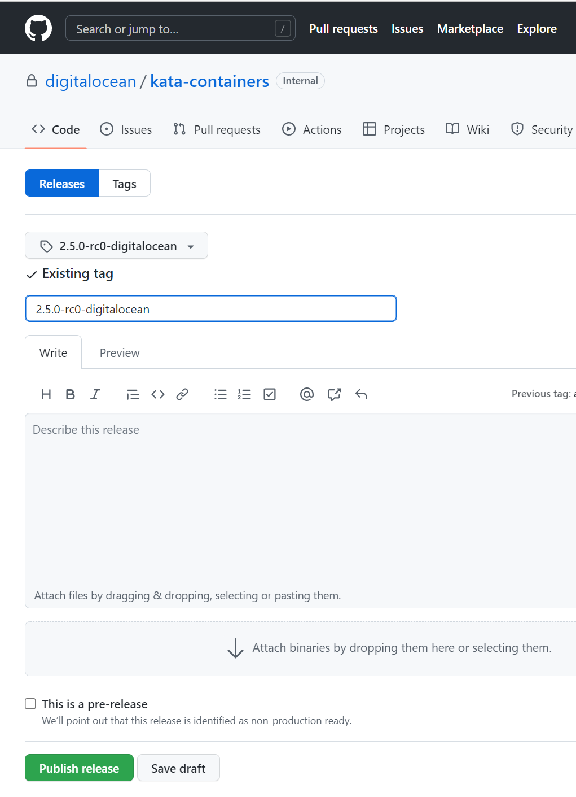

[//]: # (NOTE: Because this repo is private, the static-check link check will fail. Including the $ works around this. https://github.com/kata-containers/tests/blob/773554c04fa0d335205b7f85ce80076fed62710d/.ci/static-checks.sh#L717)

# DigitalOcean App Platform Kata Containers Fork

The App Platform team maintains a private fork for the purposes of building patched kata-container,
Linux, and QEMU binaries. This mechanism should be exercised for every kata-containers update used
in App Platform's [doks-runtimes](https://github.com/digitalocean/doks-runtimes?$) node upgrade
tooling.  

## Versions
The kata containers project selects component versions based upon the [versions.yaml](../versions.yaml) file in the root of the project.  

## QEMU Patches
The GitHub actions associated with this project will build and package QEMU for use within kata.
Kata includes a small number of patches against the vanilla QEMU project. Additional patches may
be included in our fork for security or bug fix reasons. Patches may be added to the following
directory prior to release.

```
qemu_version=$(yq eval .assets.hypervisor.qemu.version versions.yaml)
tools/packaging/qemu/patches/tag_patches/$qemu_version
```

## Guest Linux Kernel Patches
The GitHub actions associated with this project will build and package Linux for use as the guest
kernel for containers. Kata includes a small number of patches against the vanilla Linux project.
Additional patches may be included in our fork for security or bug fix reasons. Patches are
structured by minor version. For example, for Linux v5.15.48 (`yq eval .assets.kernel.version versions.yaml`) patches should be contributed to `tools/packaging/kernel/patches/5.4.x`.

## Releasing
Kata Containers cuts release tags from stable branches (ex. `stable-2.5`). These branch ultimately tie back to `main` but include many backports/cherry-picks. 

### Initial Setup
This guide assumes this remote (`git@github.com:digitalocean/kata-containers.git`) is called `origin`, and the upstream (`https://github.com/kata-containers/kata-containers.git`) is called `upstream`.

```
git clone git@github.com:digitalocean/kata-containers.git
cd kata-containers
git remote add upstream git@github.com:kata-containers/kata-containers.git
git fetch upstream
git checkout do/main # This should be the default.
```

### Adding Patches or Updating this Document
If feasible (considering time and security) non-critical patches should be made upstream in the 
[public kata containers repo](https://github.com/kata-containers/kata-containers). Once accepted
and released these can be pulled in as part of the typical release pattern.

In the event of time-critical update or changes specific to this fork's documentation / release
tooling, use the following instructions. 

Patches to QEMU or the Guest Linux Kernel should first pull-requested against the `do/main` branch. This will ensure they're carried forward for future stable releases. 

Once merged into `do/main`, they may be cherry-picked into stable branches.

```
git fetch upstream
git checkout
```

### Cutting a release
```
git fetch upstream
git checkout main
git push origin main --force

# bring the do/main branch up-to-date
git checkout do/main
git rebase upstream/main


upstream_tag=2.5.0-rc0 # Update this to match the upstream tag you want to release
git checkout $upstream_tag # This will create a detached head from upstream
git checkout -b "do/$upstream_tag"
git cherry-pick upstream/main...do/main # Pull in changes from do/main

# Tag and push the release. CI assumes this starts w/ "2."
release_tag="$upstream_tag+do.0"
git tag "$release_tag"
git push -u origin "$release_tag"
```

[Draft a new release on the fork's GitHub project](https://github.com/digitalocean/kata-containers/releases/new?$). Select the tag. The release name should be set to match the tag. 



Publish the release.

GitHub Actions should begin to generate assets, the primary one being:

```
https://github.com/digitalocean/kata-containers/releases/download/$release_tag/$release_tag-x86_64.tar.xz?$
```

### Testing and Validation
The upstream release pipeline includes minimal validation at release time.  In short, a 
[kata-deploy](../tools/packaging/kata-deploy/README.md) container image is build, pushed, and 
deployed to an Azure AKS cluster. App Platform deploys kata via the 
[doks-runtimes](https://github.com/digitalocean/doks-runtimes?$) package, which is validated with
App Platform pre-release e2e tests before use in production. These tests cover a broader range of
scenarios than the kata-deploy validations, and we have decided to accept these as sufficient
validation.